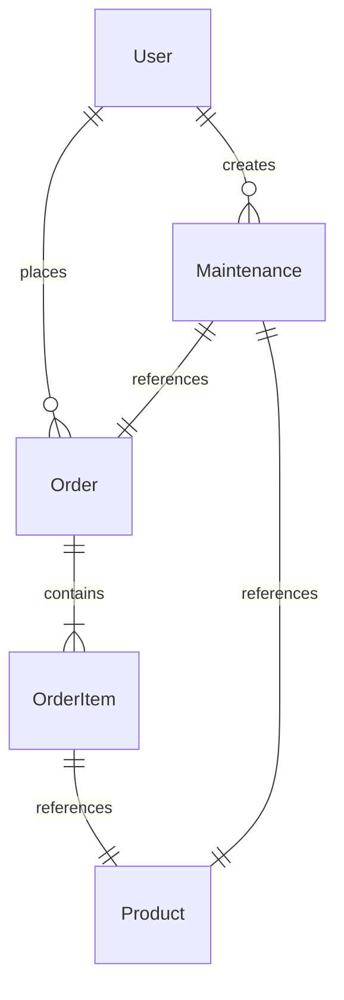

# RentEase – Detailed Project Report (DPR)

RentEase is a next-generation, responsive web-based platform designed to address the relocation challenges faced by students and working professionals. By offering flexible, affordable, and worry-free monthly rental solutions for premium furniture and home appliances, RentEase shifts the paradigm from rigid ownership to flexible, service-oriented subscription usage. 

This Detailed Project Report (DPR) serves as the comprehensive reference guide for the RentEase project, documenting the product specifications, system architecture, database design, API routing, UI flows, Systemd/Nginx configurations, setup instructions, and deployment status.

---

## 1. Executive Summary & Product Scope

### 1.1 Context & Problem Statement
Relocating for education or employment is a regular milestone for urban demographics. However, establishing a new living space presents major pain points:
* **High Capital Requirements**: Purchasing brand-new furniture and appliances represents a massive upfront financial burden.
* **Logistical Friction**: Moving heavy, bulky items between temporary apartments is expensive, labor-intensive, and prone to damaging goods.
* **Disposal & Resale Losses**: Selling owned assets at short notice leads to steep depreciation losses.
* **Unreliable Local Rental Vendors**: Traditional offline options lack product catalog transparency, offer poor quality assurances, and fail to provide timely maintenance support.

### 1.2 The RentEase Solution
RentEase solves these relocation and home-setup challenges through a service-first subscription model:
1. **Low Upfront Costs**: Instead of retail pricing, users pay a small refundable security deposit and a low monthly subscription fee.
2. **Tenure Flexibility**: Rental plans span 3, 6, 12, or 24 months, with longer commitments rewarded with progressive pricing discounts.
3. **Complimentary Bundled Services**: Every subscription package includes **free professional delivery**, **complimentary maintenance**, and **free relocation assistance** when the user moves within serviced cities.
4. **Transparent, Multi-City Logistics**: Users browse localized catalogs filtered by their operational city, ensuring item availability and prompt dispatch.

### 1.3 Project Scope
* **In-Scope**:
  * **Interactive Shopping Engine**: Responsive catalog browsing with keyword searches, category tabs, and real-time budget filters.
  * **Dynamic Tenure-Based Slider**: Visual pricing slider that dynamically displays monthly subscription fees based on chosen tenure terms (3, 6, 12, or 24 months).
  * **User Operations Portal**: Secure panel to track active leases, monitor order status, view billing data, and raise maintenance/relocation tickets.
  * **Comprehensive Vendor Admin Console**: Central control panel for calculating platform KPIs (MRR, stock utilization), managing products, updating order status, and scheduling service technicians.
  * **Production Services Deployment**: Configuration scripts to deploy backend and frontend as robust Systemd services behind an Nginx reverse-proxy setup.
* **Out-of-Scope**:
  * Native iOS and Android application binaries (optimized via a responsive mobile-first React Web App).
  * Peer-to-peer (P2P) furniture rental marketplace.
  * Automated dynamic pricing algorithms using machine learning.

---

## 2. Technical Stack & System Architecture

### 2.1 The Technology Stack
* **Frontend Core**: React 18, Vite (Fast ESM Build Tool), React Router DOM (Single Page Routing).
* **Styling**: Vanilla CSS utilizing modern CSS variables, fluid HSL palettes, glassmorphism UI structures, and micro-animations.
* **Backend Runtime**: Node.js, Express.js REST API framework.
* **Database & ODM**: MongoDB (NoSQL document database), Mongoose (Object Document Mapper).
* **Deployment & Proxying**: Nginx (Web Server and Reverse Proxy), Systemd (Process monitoring and service management).

### 2.2 System Architecture Workflow
RentEase is structured as a decoupled client-server architecture. All traffic to the servers passes through an Nginx proxy, which routes catalog/static requests to the Vite React dev server and API requests to the Express.js backend.

```mermaid
graph TD
    User([End User / Client Browser]) -->|HTTP Port 80| Nginx[Nginx Reverse Proxy]
    
    Nginx -->|Location / | ViteServer[Vite React Frontend - Port 5173]
    Nginx -->|Location /api| ExpressBackend[Express API Server - Port 5000]
    
    ExpressBackend -->|Mongoose ODM| MongoDb[(Local MongoDB Database: rentease)]
    
    subgraph Client-Side App Context
        ViteServer --> AuthCtx[Auth Context - JWT]
        ViteServer --> CityCtx[City Context - Localized Catalog]
        ViteServer --> CartCtx[Cart Context - Rental Items]
    end
    
    subgraph Backend Routing Services
        ExpressBackend --> AuthRoute[/api/auth]
        ExpressBackend --> ProdRoute[/api/products]
        ExpressBackend --> OrderRoute[/api/orders]
        ExpressBackend --> MaintRoute[/api/maintenance]
        ExpressBackend --> CityRoute[/api/cities]
    end
```

---

## 3. Database Schema Design

The application utilizes five Mongoose schemas to represent the business data model, enforcing strong document constraints while retaining NoSQL flexibility.

### 3.1 Entity-Relationship Layout


### 3.2 Detailed Schema Fields

#### 3.2.1 User Schema (`User.js`)
Handles profiles, credentials, and roles for Customers and Platform Administrators.
```javascript
{
  name: { type: String, required: true },
  email: { type: String, required: true, unique: true },
  password: { type: String, required: true, select: false },
  role: { type: String, enum: ['customer', 'admin'], default: 'customer' },
  city: { type: String, default: 'Bangalore' },
  createdAt: { type: Date, default: Date.now },
  updatedAt: { type: Date, default: Date.now }
}
```

#### 3.2.2 Product Schema (`Product.js`)
Maintains catalog details, stock levels, operational cities, and progressive rental rate multipliers.
```javascript
{
  name: { type: String, required: true, trim: true },
  category: { type: String, enum: ['Furniture', 'Appliances'], required: true },
  subcategory: { type: String, required: true },
  description: { type: String, required: true },
  images: { type: [String], required: true },
  baseRent: { type: Number, required: true },
  deposit: { type: Number, required: true },
  tenureRates: { 
    type: Map, 
    of: Number, 
    default: { '3': 1.0, '6': 0.85, '12': 0.70, '24': 0.60 }
  }, // Represents multipliers: e.g., 24 months yields a 40% discount off baseRent
  inventory: { type: Number, required: true, default: 5 },
  rentedCount: { type: Number, default: 0 },
  citiesAvailable: { type: [String], default: ['Bangalore', 'Mumbai', 'Delhi', 'Pune', 'Chennai'] }
}
```

#### 3.2.3 Order Schema (`Order.js`)
Tracks the active rental leases, payments, delivery coordinates, and specific tenure parameters selected for each product in the contract.
```javascript
{
  user: { type: mongoose.Schema.Types.ObjectId, ref: 'User', required: true },
  items: [{
    product: { type: mongoose.Schema.Types.ObjectId, ref: 'Product', required: true },
    tenure: { type: Number, required: true }, // Chosen tenure term: 3, 6, 12, or 24 months
    monthlyRent: { type: Number, required: true }, // Saved monthly cost applying tenure rate multiplier
    securityDeposit: { type: Number, required: true },
    quantity: { type: Number, required: true, default: 1 }
  }],
  totalMonthlyRent: { type: Number, required: true },
  totalSecurityDeposit: { type: Number, required: true },
  deliveryAddress: { type: String, required: true },
  deliveryCity: { type: String, required: true },
  deliveryDate: { type: Date, required: true },
  status: { 
    type: String, 
    enum: ['Pending Delivery', 'Active', 'Returned', 'Cancelled'], 
    default: 'Pending Delivery' 
  },
  paymentStatus: { type: String, enum: ['Pending', 'Paid'], default: 'Paid' },
  createdAt: { type: Date, default: Date.now }
}
```

#### 3.2.4 Maintenance Schema (`Maintenance.js`)
Supports service requests, damage claims, transport coordination, and item returns. Includes technician dispatch scheduling.
```javascript
{
  user: { type: mongoose.Schema.Types.ObjectId, ref: 'User', required: true },
  order: { type: mongoose.Schema.Types.ObjectId, ref: 'Order', required: true },
  product: { type: mongoose.Schema.Types.ObjectId, ref: 'Product', required: true },
  issueType: { 
    type: String, 
    enum: ['Repair & Maintenance', 'Damage Claim', 'Relocation Support', 'Return Request'], 
    required: true 
  },
  description: { type: String, required: true },
  status: { type: String, enum: ['Pending', 'In Progress', 'Resolved'], default: 'Pending' },
  scheduledDate: { type: Date }, // Set by admin to allocate service time
  createdAt: { type: Date, default: Date.now }
}
```

#### 3.2.5 City Schema (`City.js`)
Configures service coverage areas across regional logistics networks.
```javascript
{
  name: { type: String, required: true, unique: true },
  isActive: { type: Boolean, default: true }
}
```

---

## 4. API Endpoint Specifications

All endpoints under `/api` correspond to core functional operations. Private endpoints require a header authorization parameter: `Authorization: Bearer <JWT_Token>`.

### 4.1 Authentication (`/api/auth`)
* `POST /register`: Registers a new account. Expects `{ name, email, password, city }`. Returns user schema and a JWT sign token.
* `POST /login`: Logs in a registered user. Expects `{ email, password }`. Returns user metadata and sign token.
* `GET /profile` [Private]: Retrieves credentials and session values for the current user token.
* `PUT /profile` [Private]: Updates name, city, or password parameters.

### 4.2 Product Operations (`/api/products`)
* `GET /`: Lists all active products. Supports query parameters `city`, `category`, `subcategory`, and search term `q`.
* `GET /:id`: Returns details of a specific item, cataloging active tenure plans.
* `POST /` [Private/Admin]: Adds a new item configuration into the active catalogue.
* `PUT /:id` [Private/Admin]: Edits product metadata, inventory sizes, and city support.
* `DELETE /:id` [Private/Admin]: Removes a listing from active product catalogs.

### 4.3 Order Management (`/api/orders`)
* `POST /` [Private]: Places a rental lease order. Decrements product inventory, increments product `rentedCount`, validates that chosen cities align, and schedules delivery logs.
* `GET /user` [Private]: Retrieves the history of rental leases and schedules for the logged-in customer.
* `GET /` [Private/Admin]: Gathers all database orders for performance analysis.
* `PUT /:id/status` [Private/Admin]: Updates the order workflow status (`Pending Delivery` -> `Active` -> `Returned` / `Cancelled`). Cancelled and returned items automatically increment inventory levels back.

### 4.4 Maintenance Operations (`/api/maintenance`)
* `POST /` [Private]: Initiates a ticket matching a specific active order item.
* `GET /user` [Private]: Gathers all support tickets submitted by the logged-in user.
* `GET /` [Private/Admin]: Collects all platform tickets for review.
* `PUT /:id` [Private/Admin]: Updates ticket status (`Pending`, `In Progress`, `Resolved`) and registers a technician's visit date/time.

### 4.5 City Operations (`/api/cities`)
* `GET /`: Lists all operational municipalities.
* `POST /` [Private/Admin]: Creates a new operational region.

---

## 5. UI Architecture & Features

The React application implements single-page routing, global state synchronization, and custom styling to offer a fluid experience.

### 5.1 Key UI Pages & Flows
1. **Landing & Splash (Home)**: Highlights the RentEase value proposition (zero maintenance costs, flexibility, refunds). Contains live platform counter widgets and direct links to start shopping.
2. **Global City Selector**: Managed in global context (`CityContext`). Changes state on selection and propagates to the catalog, showing only items available in the selected city.
3. **Interactive Catalog Browser**: Users can filter products by Category tabs (Furniture, Appliances), search text queries, choose specific subcategories, and filter with interactive budget sliders.
4. **Tenure Pricing Configurator**: Integrated on the Product Details page. Features a custom slider allowing selection between 3, 6, 12, and 24 months, illustrating progressive discounts (e.g. up to 40% discount for a 24-month lease).
5. **Checkout & Schedule Pipeline**: Cart items calculate aggregate deposits and monthly rents. Checkout forms validate delivery addresses and ensure the delivery date is scheduled at least 48 hours in the future.
6. **User Portal**: Displays active orders, billing/subscription amounts, and a portal to submit support requests or schedule product returns.
7. **Vendor Admin Dashboard**: Displays real-time calculations:
   * **Monthly Recurring Revenue (MRR)**: Aggregate monthly rents of all active leases.
   * **Active Leases**: Count of current orders.
   * **Stock Utilization**: Ratio of leased inventory vs total stock.
   * **Support Ticket Counter**: Unresolved maintenance and return requests.
   It also provides tabular view managers to edit products, update order statuses, schedule technician appointments, and activate new cities.

---

## 6. Service Deployment & Nginx Configurations

To make RentEase production-ready on local systems, the microservices were configured to run in the background as system services, routed through Nginx.

### 6.1 Systemd Service Files
To ensure backend Node.js and frontend dev servers survive crashes and reboots, two service files were defined:

#### Backend Service (`/etc/systemd/system/rentease-backend.service`)
```ini
[Unit]
Description=RentEase Node.js Backend Service
After=network.target mongod.service

[Service]
Type=simple
User=ubuntu
WorkingDirectory=/home/ubuntu/MyProjects/RentEase/backend
ExecStart=/usr/bin/node server.js
Restart=on-failure
Environment=NODE_ENV=production

[Install]
WantedBy=multi-user.target
```

#### Frontend Service (`/etc/systemd/system/rentease-frontend.service`)
```ini
[Unit]
Description=RentEase Vite Frontend Dev Server
After=network.target

[Service]
Type=simple
User=ubuntu
WorkingDirectory=/home/ubuntu/MyProjects/RentEase/frontend
ExecStart=/usr/bin/npm run dev
Restart=on-failure
Environment=NODE_ENV=development

[Install]
WantedBy=multi-user.target
```

### 6.2 Nginx Web Reverse Proxy (`rentease.nginx`)
Configured to forward inbound browser traffic on port 80 to the appropriate local server. Vite's proxy receives the default path (`/`), and Express's backend routes the API path (`/api`).
```nginx
server {
    listen 80;
    server_name 24x7stream.qzz.io 140.245.217.195;

    client_max_body_size 50M;

    # Proxy to Vite dev server
    location / {
        proxy_pass http://127.0.0.1:5173;
        proxy_http_version 1.1;
        proxy_set_header Upgrade $http_upgrade;
        proxy_set_header Connection 'upgrade';
        proxy_set_header Host $host;
        proxy_cache_bypass $http_upgrade;
    }

    # Proxy API requests to Node.js backend
    location /api {
        proxy_pass http://127.0.0.1:5000;
        proxy_http_version 1.1;
        proxy_set_header Upgrade $http_upgrade;
        proxy_set_header Connection 'upgrade';
        proxy_set_header Host $host;
        proxy_cache_bypass $http_upgrade;
        proxy_set_header X-Real-IP $remote_addr;
        proxy_set_header X-Forwarded-For $proxy_add_x_forwarded_for;
        proxy_set_header X-Forwarded-Proto $scheme;
    }
}
```

### 6.3 Vite Port Mapping & Host Configuration
To prevent cross-site websocket handshake rejections in the Nginx proxy environment, the development configuration in `frontend/vite.config.js` was modified to accept external domain headers:
```javascript
import { defineConfig } from 'vite'
import react from '@vitejs/plugin-react'

// https://vitejs.dev/config/
export default defineConfig({
  plugins: [react()],
  server: {
    port: 5173,
    host: true,
    strictPort: true,
    allowedHosts: true, // Enables proxy bypass
  }
})
```

---

## 7. Execution & Setup Instructions

### 7.1 Running Services Locally (Manual Mode)

#### 1. Setup Backend
1. Navigate to the backend directory:
   ```bash
   cd backend
   ```
2. Install npm dependencies:
   ```bash
   npm install
   ```
3. Run the database seed script to populate products, operational cities, and mock users:
   ```bash
   npm run seed
   ```
4. Start the backend development server:
   ```bash
   npm run dev
   ```

#### 2. Setup Frontend
1. Navigate to the frontend directory:
   ```bash
   cd ../frontend
   ```
2. Install npm dependencies:
   ```bash
   npm install
   ```
3. Start the Vite development server:
   ```bash
   npm run dev
   ```
4. Access the application on `http://localhost:5173`.

### 7.2 Credentials Seeded in Database
Seeding the database creates the following default login accounts:
* **Customer Account**:
  * **Email**: `user@rentease.com`
  * **Password**: `user123`
* **Admin Account**:
  * **Email**: `admin@rentease.com`
  * **Password**: `admin123`

---

## 8. Development Progress Summary
All core deliverables for the RentEase microservices setup have been configured and verified:
1. **Core Database and Seeding**: Cleaned and successfully seeded collection data. Resolved an admin-creation role assignment bug in the seed script.
2. **API Integrations**: Fully documented standard Mongoose collections and JWT authorization controls.
3. **Responsive Interface**: Delivered dynamic tenure rate-sliders, client-side budget filters, checkout date boundary validations, and an interactive admin statistics console.
4. **Service Infrastructure**: Integrated Systemd processes and custom Nginx reverse proxy directives to manage web routing and service failovers.
