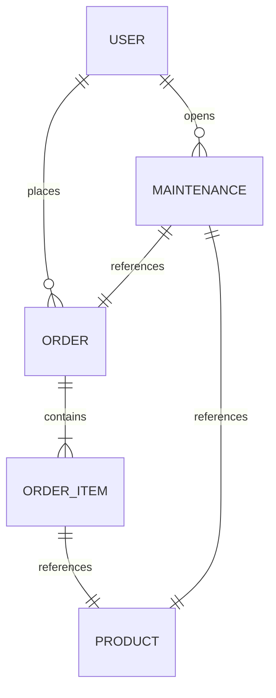

# RentEase – Product Requirements Document (PRD) & Technical Documentation

RentEase is a modern, responsive web-based platform designed to address relocation challenges for students and working professionals by offering a flexible, affordable, and worry-free monthly rental solution for essential furniture and appliances.

---

## 1. Executive Summary & Product Requirements

### 1.1 Context & Problem Statement
Relocating for jobs or education is a common reality in urban areas. Renters face several critical barriers:
* **High Upfront Costs**: Purchasing new furniture and appliances requires substantial initial capital.
* **Relocation Logistical Hassles**: Transporting heavy items between flats is expensive and physically exhausting.
* **Rigid Ownership**: Buying items means having to sell them later, often at a steep loss, or pay high moving fees.
* **Unreliable Local Vendors**: Local rental shops often have outdated options, poor customer service, and slow maintenance.

RentEase solves this by providing a monthly subscription-based renting model for high-quality items, bundled with **free maintenance**, **free relocation support**, and **refundable security deposits**.

### 1.2 Objectives
* **Primary**: Simplify access to essential furniture and appliances, lower upfront living costs, offer flexible pricing tiers based on tenure, and provide a mobile-first responsive rental shopping experience.
* **Secondary**: Reduce waste from throwaway furniture purchases, promote circular and sustainable consumption, and build a highly scalable, multi-city logistics ecosystem.

### 1.3 Scope of Work
* **In-Scope**:
  * Fully responsive mobile-first React frontend.
  * Robust Node.js / Express REST API backend connected to a MongoDB database.
  * Dynamic pricing based on rental tenure options (3, 6, 12, 24 months) with progressive discounts.
  * Comprehensive User Portal for active leases and maintenance requests.
  * Administrative Dashboard for tracking MRR, product utilization rates, managing inventory, updating orders/deliveries, scheduling technicians, and editing active service areas.
* **Out of Scope**:
  * Native iOS/Android applications (responsive web app is provided).
  * Cross-border/international rentals (localized to serviced cities).
  * Auto-calculated AI pricing models.
  * Second-hand peer-to-peer resale marketplace.

---

## 2. System Architecture

RentEase follows a classic decoupled **client-server** architecture using a modern tech stack. The frontend is built using **Vite + React (ESM)**, styled with clean vanilla CSS tailored for a premium glassmorphic dark mode. The backend is a **Node.js/Express** app feeding from a **MongoDB** database via **Mongoose ODM**.

```mermaid
graph TD
    Client[React Web Application (Port 5174)] -->|REST APIs / JWT| Server[Express API Server (Port 5000)]
    Server -->|Mongoose ODM| DB[(MongoDB database: rentease)]
    
    subgraph Client-Side Contexts
        AuthContext[Auth Context]
        CityContext[City Context]
        CartContext[Cart Context]
    end
    
    subgraph Server-Side Services
        AuthRoute["/api/auth"]
        ProductRoute["/api/products"]
        OrderRoute["/api/orders"]
        MaintRoute["/api/maintenance"]
        CityRoute["/api/cities"]
    end
    
    Client --> Client-Side Contexts
    Server --> Server-Side Services
```

---

## 3. Database Schema Design

The application utilizes five core MongoDB collections: `users`, `products`, `cities`, `orders`, and `maintenances`.



### 3.1 User Schema (`User.js`)
Stores customer and administrator profile details.
```typescript
{
  name: { type: String, required: true },
  email: { type: String, required: true, unique: true },
  password: { type: String, required: true, select: false },
  role: { type: String, enum: ['customer', 'admin'], default: 'customer' },
  city: { type: String, default: 'Bangalore' },
  createdAt: Date,
  updatedAt: Date
}
```

### 3.2 Product Schema (`Product.js`)
Holds rental inventory specifications, city stock allocations, and tenure-based price discounts.
```typescript
{
  name: { type: String, required: true, trim: true },
  category: { type: String, enum: ['Furniture', 'Appliances'], required: true },
  subcategory: { type: String, required: true },
  description: { type: String, required: true },
  images: { type: [String], required: true },
  baseRent: { type: Number, required: true }, // Monthly base cost
  deposit: { type: Number, required: true }, // Refundable upfront deposit
  tenureRates: { 
    type: Map, 
    of: Number, 
    default: { '3': 1.0, '6': 0.85, '12': 0.70, '24': 0.60 }
  }, // Multipliers: e.g., renting for 24 months gives a 40% discount on baseRent
  inventory: { type: Number, required: true, default: 5 }, // Stock available
  rentedCount: { type: Number, default: 0 }, // Active lease count
  citiesAvailable: { type: [String], default: ['Bangalore', 'Mumbai', 'Delhi', 'Pune', 'Chennai'] }
}
```

### 3.3 Order Schema (`Order.js`)
Tracks active lease agreements, scheduled deliveries, addresses, and pricing summaries.
```typescript
{
  user: { type: mongoose.Schema.Types.ObjectId, ref: 'User', required: true },
  items: [{
    product: { type: mongoose.Schema.Types.ObjectId, ref: 'Product', required: true },
    tenure: { type: Number, required: true }, // Chosen months (3, 6, 12, 24)
    monthlyRent: { type: Number, required: true }, // Monthly cost at chosen tenure
    securityDeposit: { type: Number, required: true }, // Security deposit paid
    quantity: { type: Number, required: true, default: 1 }
  }],
  totalMonthlyRent: { type: Number, required: true }, // Sum of items' monthly rent
  totalSecurityDeposit: { type: Number, required: true }, // Sum of items' security deposits
  deliveryAddress: { type: String, required: true },
  deliveryCity: { type: String, required: true },
  deliveryDate: { type: Date, required: true },
  status: { 
    type: String, 
    enum: ['Pending Delivery', 'Active', 'Returned', 'Cancelled'], 
    default: 'Pending Delivery' 
  },
  paymentStatus: { type: String, enum: ['Pending', 'Paid'], default: 'Paid' },
  createdAt: Date
}
```

### 3.4 Maintenance Schema (`Maintenance.js`)
Tracks repair requests, relocation assistance tickets, return pickups, and technician visit schedules.
```typescript
{
  user: { type: mongoose.Schema.Types.ObjectId, ref: 'User', required: true },
  order: { type: mongoose.Schema.Types.ObjectId, ref: 'Order', required: true },
  product: { type: mongoose.Schema.Types.ObjectId, ref: 'Product', required: true },
  issueType: { 
    type: String, 
    enum: ['Repair & Maintenance', 'Damage Claim', 'Relocation Support', 'Return Request'], 
    required: true 
  },
  description: { type: String, required: true },
  status: { type: String, enum: ['Pending', 'In Progress', 'Resolved'], default: 'Pending' },
  scheduledDate: { type: Date }, // Date scheduled by administrator for technician visit
  createdAt: Date
}
```

### 3.5 City Schema (`City.js`)
Active service areas for logistics operations.
```typescript
{
  name: { type: String, required: true, unique: true },
  isActive: { type: Boolean, default: true }
}
```

---

## 4. API Endpoint Specifications

All private endpoints require a JSON Web Token (JWT) sent in the request header: `Authorization: Bearer <token>`.

### 4.1 Authentication (`/api/auth`)
* `POST /register`: Registers a new user account. Returns user profile details and JWT access token.
* `POST /login`: Log in with email and password. Returns user object and JWT.
* `GET /profile`: Private. Retrieves logged-in user profile.
* `PUT /profile`: Private. Updates logged-in user details (name, city, password).

### 4.2 Products (`/api/products`)
* `GET /`: Retrieves all products. Supports filtering queries: `city`, `category`, `subcategory`, and search string `q`.
* `GET /:id`: Retrieves full details for a single product.
* `POST /`: Private/Admin. Creates a new product catalog listing.
* `PUT /:id`: Private/Admin. Updates product information.
* `DELETE /:id`: Private/Admin. Deletes product listing.

### 4.3 Orders (`/api/orders`)
* `POST /`: Private. Creates a new lease order. Validates inventory levels, decrements product inventory, increments `rentedCount`, calculates tenure rates, and inserts the contract.
* `GET /user`: Private. Retrieves the current logged-in user's order history.
* `GET /`: Private/Admin. Retrieves all orders across the platform.
* `PUT /:id/status`: Private/Admin. Updates delivery/lease status (e.g. mark as `Active`, `Returned`, or `Cancelled`). If returned/cancelled, inventory automatically reinstates.

### 4.4 Maintenance (`/api/maintenance`)
* `POST /`: Private. Creates a service/relocation/return ticket. Validates order ownership and matching product.
* `GET /user`: Private. Retrieves logged-in user's raised support tickets.
* `GET /`: Private/Admin. Retrieves all tickets across the platform.
* `PUT /:id`: Private/Admin. Schedules technician visit datetime and changes status (`Pending`, `In Progress`, `Resolved`).

### 4.5 Cities (`/api/cities`)
* `GET /`: Retrieves all active service cities.
* `POST /`: Private/Admin. Creates a new operational service city.

---

## 5. UI Features & User Flows

The frontend features a clean, responsive layout built using React Hooks, React Router, and a context-driven global state.

```
User Flow:
Landing Page (Select City) ──> Catalog Browser ──> Product Details (Tenure Selection) ──> Cart Review ──> Checkout Form (Schedule Delivery) ──> User Portal (Track Lease & Raise Tickets)
```

### 5.1 Shopping Experience (User Features)
1. **Landing Page**: Features a value-proposition hero banner, key program benefit list, real-time statistics widget, and a localized catalog entry point.
2. **City Selector (Header)**: The top navbar houses a dropdown listing active service cities. Swapping cities changes the global context, instantly re-filtering catalog items to display only locally available inventory.
3. **Responsive Catalog browser**: Supports search by keywords, category filter tags, subcategory selectors, and client-side max budget sliders.
4. **Interactive Tenure Pricing Slider**: On the single product details page, users see a custom dot track matching the 3, 6, 12, and 24-month tenure plans. Swapping dots recalculates monthly rent, displays security deposits, and highlights savings percentages.
5. **Simulated Payment & Checkout**: Cart reviews deposits and monthly rents. During checkout, users select a delivery date (validated 48h in advance) and input their address. Payment is simulated automatically to complete the order.
6. **User Portal**: Allows tracking delivery status, viewing payment history, and raising maintenance, transport, or return tickets for active items.

### 5.2 Vendor Administration (Admin Features)
1. **Analytics Dashboard**: Real-time widgets tracking:
   * **Monthly Recurring Revenue (MRR)**: Sum of monthly rent from all active lease contracts.
   * **Active Leases Count**: Count of active orders.
   * **Stock Utilization Rate**: Percentage of overall hardware stock leased to customers.
   * **Pending Issues**: Counter of unresolved maintenance/return requests.
2. **Inventory Manager**: Add new catalog listings with specs, pricing, stock levels, and cities. Includes a table listing current stock with dynamic counters.
3. **Lease/Order Tracker**: Full index of placed orders. Administrators can update delivery status via dropdown selections.
4. **Service Technician Scheduler**: Allows administration to view raised tickets, schedule technician visits by updating dates/times, and modify status.
5. **Active City Manager**: Create and activate new service areas.

---

## 6. Execution & Setup Instructions

### 6.1 Prerequisites
* **Node.js** (v18.0.0 or higher recommended)
* **MongoDB** running locally on port `27017`

### 6.2 Setup Backend
1. Navigate to the backend directory:
   ```bash
   cd backend
   ```
2. Install npm dependencies:
   ```bash
   npm install
   ```
3. Configure environment variables in `.env` (a pre-configured `.env` has been set up with defaults):
   ```env
   PORT=5000
   MONGO_URI=mongodb://localhost:27017/rentease
   JWT_SECRET=rentease_jwt_secret_key_2026_xyz
   NODE_ENV=development
   ```
4. Run the database seed script to populate products, operational cities, and mock users:
   ```bash
   npm run seed
   ```
5. Start the backend development server:
   ```bash
   npm run dev
   ```

### 6.3 Setup Frontend
1. Navigate to the frontend directory:
   ```bash
   cd ../frontend
   ```
2. Install npm dependencies:
   ```bash
   npm install
   ```
3. Start the Vite development server:
   ```bash
   npm run dev
   ```
4. Open your browser and navigate to `http://localhost:5174` (or the port specified by Vite in the terminal).

### 6.4 Seeding Credentials
Seeding the database creates the following default login accounts:
* **Customer Account**:
  * **Email**: `user@rentease.com`
  * **Password**: `user123`
* **Admin Account**:
  * **Email**: `admin@rentease.com`
  * **Password**: `admin123`
